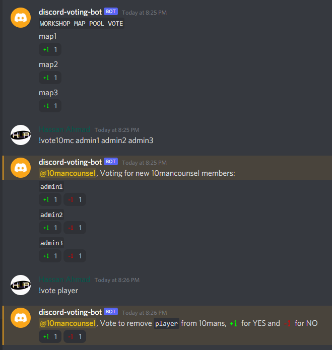

# discord-voting-bot
This is a Discord BOT that allows users to vote for maps, admins and removing players from 10mans

### Commands

 - !map map1 map2 map3 
  (This command takes infinite number of maps and puts each map in a new line and reacts with +1)

 - !vote10mc admin1 admin2 admin3
  (This command takes infinite number of potential admins and puts each admin in a new line and reacts with +1 and -1)

 - !vote player
  (This command takes a player and reacts with +1 and -1)

  
## Tech Stack

 - Python
 - ~~discord.py~~
